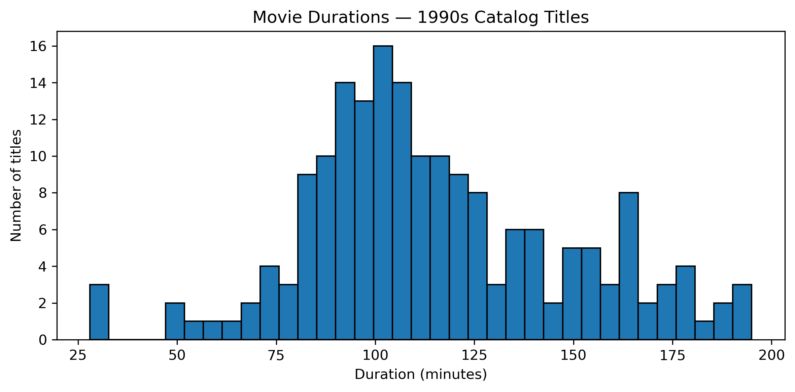
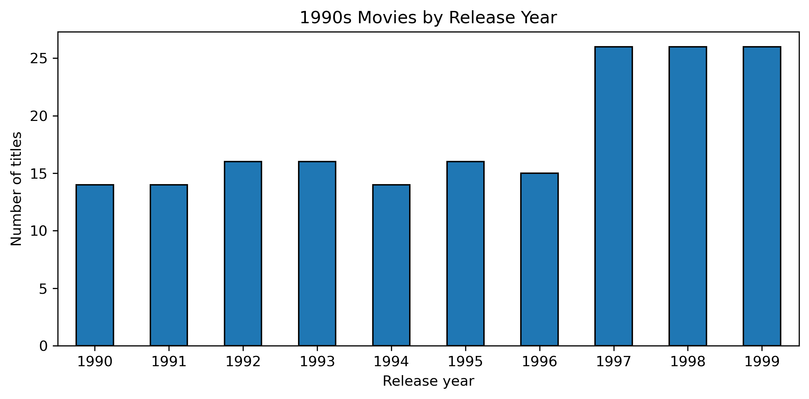
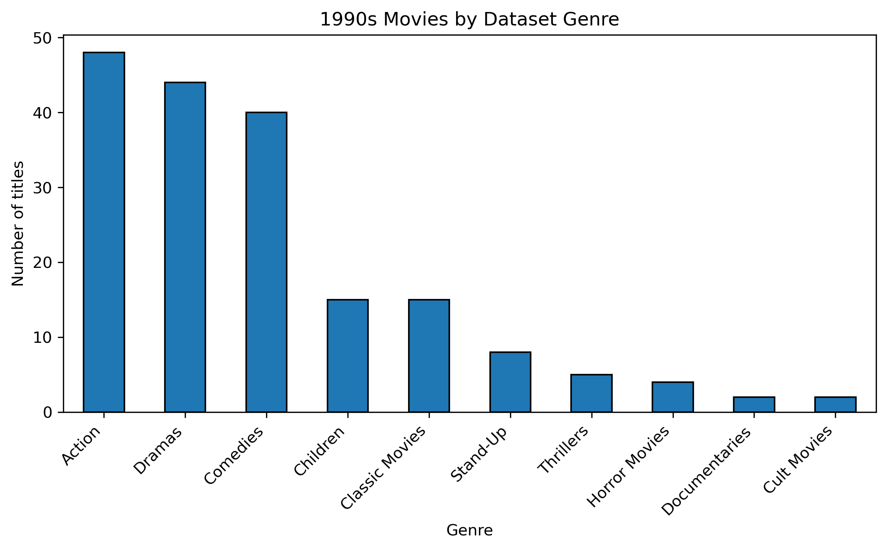

# Netflix 1990s Movies — Exploratory Data Analysis

**Author:** Andreza Eufrasio

**Stack:** Python, pandas, numpy, matplotlib

**Notebook:** [netflix_1990s_movies_case_study.ipynb](netflix_1990s_movies_case_study.ipynb)

---

## Project Overview

This project explores Netflix movies released during the 1990s to identify patterns in movie duration, genres, and release years. The analysis uses Python for data manipulation, exploratory data analysis, and visualization.

---

## Key Questions

1. What was the most frequent movie duration in the 1990s?
2. How many short-Action movies (less than 90 min) were released in the 1990s?
3. Which year in the 1990s had the most movie releases?
4. Which genres dominated the decade?
5. Were any content gaps identified?

---

## Dataset

The analysis uses `netflix_data.csv`, containing Netflix title information including release year, duration, and genre.

The data was cleaned before analysis by checking missing values, correcting minor inconsistencies, identifying placeholder values, checking duplicates, and validating the data used in the analysis.

---

## Requirements:
Python 3.12.7  
pip install -r requirements.txt

---

## How to Reproduce

1. Place `data/netflix_data.csv` in the `data/` folder.
2. Open `netflix_1990s_case_study.ipynb`.
3. **Run cells top-to-bottom.**
4. See answers under sections **Q1–Q5**, with insights and recommendations. 

---

## Summary of Insights

- **Most frequent duration:** 94 minutes was the most common movie duration, appearing in 7 titles. The histogram shows that most movie durations were concentrated around 90–110 minutes, although the dataset includes both shorter and longer movies.
  

  
- **Short Action movies (<90 min):** 7 titles (3.8%) were shorter than 90 minutes, representing a small portion of the Action movies analyzed.

- **Peak release years:** 1997, 1998, and 1999 had the highest number of movie releases in the dataset, with 26 titles each. This was an increase from the 14–16 movies per year recorded between 1990 and 1996.

  

- **Top genres:** Action (48), Drama (44), and Comedy (40) were the most represented genres, accounting for approximately 72.1% (132 of 183 movies) of the 1990s Netflix dataset.
  

  
- **Potential content gaps:** Five genres fell below the median of 11.5 movies per genre: Stand-Up (8), Thrillers (5), Horror Movies (4), Documentaries (2), and Cult Movies (2). Documentaries and Cult Movies had the lowest representation, with only 2 titles each.
  

---

## Potential Applications

This educational case study demonstrates how exploratory data analysis can support content organization and discovery.

- **Duration-Based Collections:** Create collections of approximately 90-minute movies and short Action films to help viewers discover titles based on their available viewing time.

- **Nostalgic Curation:** Organize movies released between 1997 and 1999 into themed collections highlighting late-1990s titles.

- **Genre Discovery:** Feature Action, Drama, and Comedy in dedicated 1990s movie collections, reflecting their strong representation in the dataset.

- **Content Diversity:** Create themed collections featuring less-represented genres, such as Stand-Up, Thrillers, Horror Movies, Documentaries, and Cult Movies, to improve their visibility.s, Horror Movies, Documentaries, and Cult Movies, to improve their visibility.
---

## Notebook

The final polished notebook is available here:https://andrezascientist.github.io/investigating-netflix-movies/

